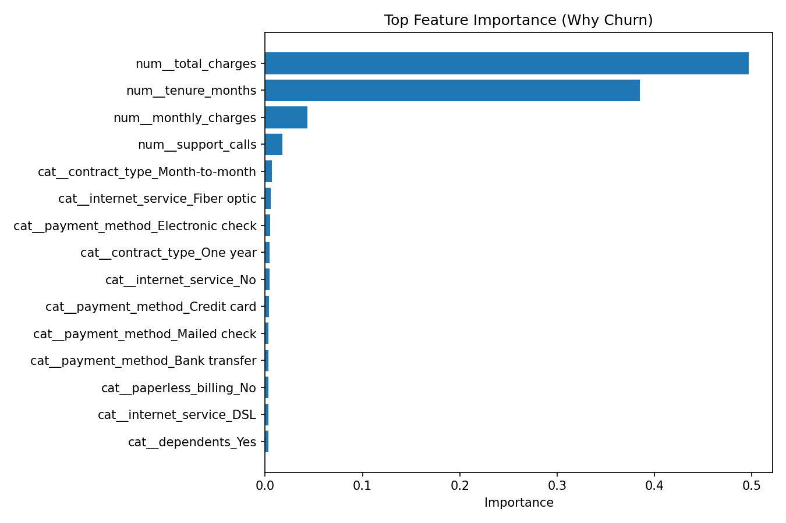
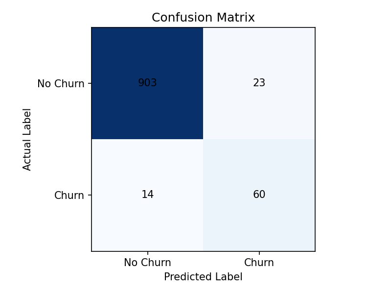

# Customer Churn Prediction Project


End-to-end churn analytics project for telecom/subscription businesses: data prep, model training, explainability, batch scoring, and live dashboard.

## Key Results

- Accuracy: `0.9630`
- Precision: `0.7229`
- Recall: `0.8108`
- F1 Score: `0.7643`
- ROC-AUC: `0.9836`

This means the model is strong at separating churn vs non-churn customers and useful for retention targeting.

## Why This Project Matters

- Predicts who is likely to leave before they churn
- Helps retention teams focus on high-risk customers
- Reduces untargeted campaign spending
- Improves customer lifetime value through early action

## Tech Stack

- Python
- Pandas, NumPy
- Scikit-learn
- Matplotlib
- Streamlit

## Project Structure

- `churn_project.py`: train + evaluate + save artifacts
- `predict_churn.py`: second script for batch predictions on new customers
- `dashboard.py`: interactive live dashboard for metrics and single-customer prediction
- `PROJECT_STORY.md`: business narrative and portfolio framing
- `PORTFOLIO.md`: publish checklist for GitHub/LinkedIn
- `sample_new_customers.csv`: sample input for batch scoring
- `requirements.txt`: dependencies
- `artifacts/`: output model, charts, and predictions
- `.github/workflows/ci.yml`: CI pipeline for smoke tests and linting
- `.devcontainer/devcontainer.json`: 1-click Codespaces environment
- `docs/index.md`: GitHub Pages-ready project report

## Quick Start

```bash
pip install -r requirements.txt
python churn_project.py
python predict_churn.py --input sample_new_customers.csv
python -m streamlit run dashboard.py
```

## Real Kaggle Dataset Support

Recommended dataset:
- Telco Customer Churn (`WA_Fn-UseC_-Telco-Customer-Churn.csv`)

Place the CSV in `customer_churn_project/data/` and run:

```bash
python churn_project.py --data-path data/WA_Fn-UseC_-Telco-Customer-Churn.csv
```

If `--data-path` is not provided, synthetic reproducible data is used.

## Visual Outputs

Generated charts and reports:
- `artifacts/metrics_bar.png`
- `artifacts/confusion_matrix.png`
- `artifacts/feature_importance.png`
- `artifacts/results.json`
- `artifacts/test_predictions.csv`
- `artifacts/new_customer_predictions.csv`

## Screenshots

Add your screenshots here after running:

- Dashboard home (Streamlit)
- Top churn drivers chart
- Confusion matrix chart

Example markdown you can use:

```md



```

## Company/Service Context

This repository models a telecom/subscription churn use case and can be adapted to:
- Telecom operators
- Internet service providers
- SaaS/streaming subscriptions

It is not tied to a specific real company unless a company dataset is provided.

## Data Ethics and Compliance

Use public, licensed, anonymized datasets (like Kaggle).

Avoid private or unauthorized collection methods because they may cause:
- Legal and terms-of-service violations
- Privacy risks for personal data
- Data quality and sampling bias issues

## GitHub Student Pack Setup

This project is pre-configured for Student Pack friendly workflows:

- **GitHub Actions CI**: runs lint and smoke tests on push/PR
- **Codespaces**: ready-to-run dev container config
- **GitHub Pages**: `docs/index.md` scaffold for project report site
- **Templates**: issue and PR templates for professional collaboration

After pushing:

1. Open `Actions` tab and enable workflows.
2. Open `Code` -> `Codespaces` -> `Create codespace on main`.
3. Open `Settings` -> `Pages` and publish from `main` branch `/docs`.
